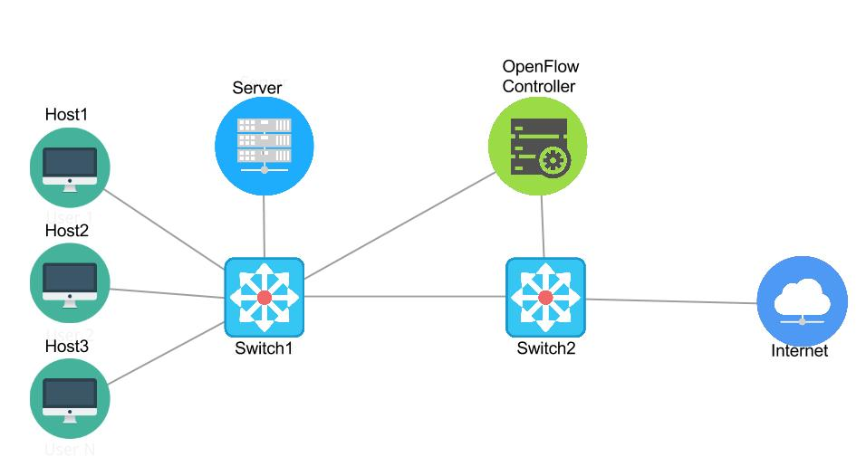

# mininetAccessControl

## Setup
http://www.brianlinkletter.com/set-up-mininet/

## Topology

## Init
###-> in virtual machine
$ sudo dhclient eth1
$ ifconfig eth1

###-> in Terminal
// in terminal
`$ ssh -Y mininet@192.168.56.101`

*user: mininet | pw: mininet

## Add custom topology

`$ nano ~/mininet/custom/authTopo.py`

*paste the content of authTopo.py from the github repo

## test custom topologie
`$ sudo mn --custom ~/mininet/custom/authTopo.py --topo authtopo --test pingall`

##Useful tools
####Mininet GUI
http://www.brianlinkletter.com/how-to-use-miniedit-mininets-graphical-user-interface/
