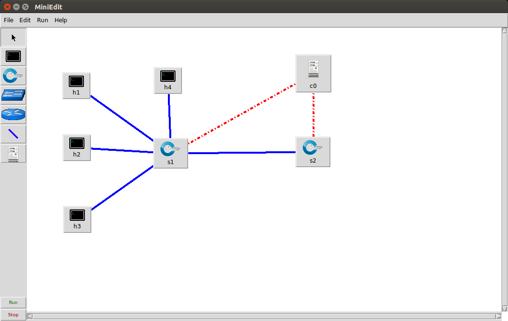

# mininetAccessControl

## Setup
http://www.brianlinkletter.com/set-up-mininet/

## Topology

## Topology of authTopo.py

## Setup
###-> in virtual machine
$ sudo dhclient eth1
$ ifconfig eth1

###-> in Terminal
`$ ssh -Y mininet@192.168.56.101`
or
`$ ssh -X mininet@192.168.56.101'

*user: mininet | pw: mininet

## Run authTopo.py
1. Clone this repo in your virtual machine 
2. cd into `mininetAccessControl`
3. Make authTopo executable by running `$ sudo chmod 777 authTopo.py`
3. run `$ sudo ./authTopo.py`

This runs a custom topology with a Server on host 4
##Useful tools
####Mininet GUI
http://www.brianlinkletter.com/how-to-use-miniedit-mininets-graphical-user-interface/

##Troubleshooting
For Error:
`Exception: Error creating interface pair (s1-eth1,s2-eth1): RTNETLINK answers: File exists`
run
`$ sudo mn -c`

##Controller used
[Ryu](https://osrg.github.io/ryu/)
[Ryu Starter pack](http://sdnhub.org/releases/sdn-starter-kit-ryu/)